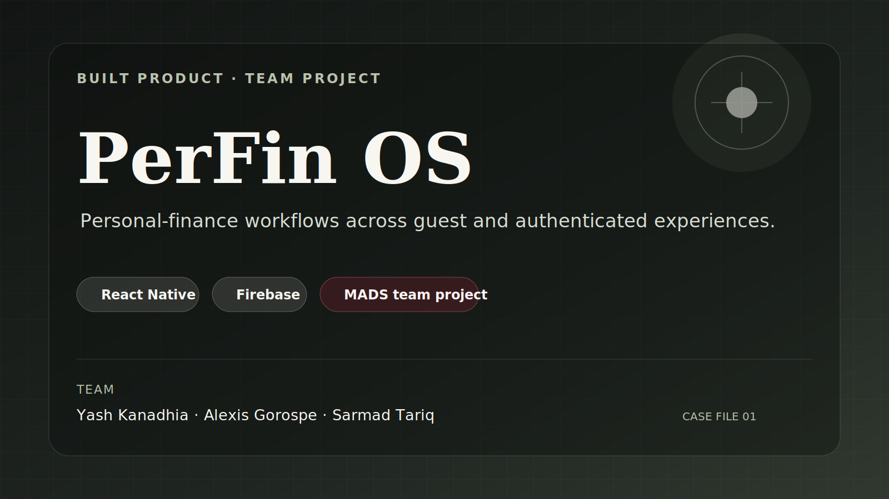
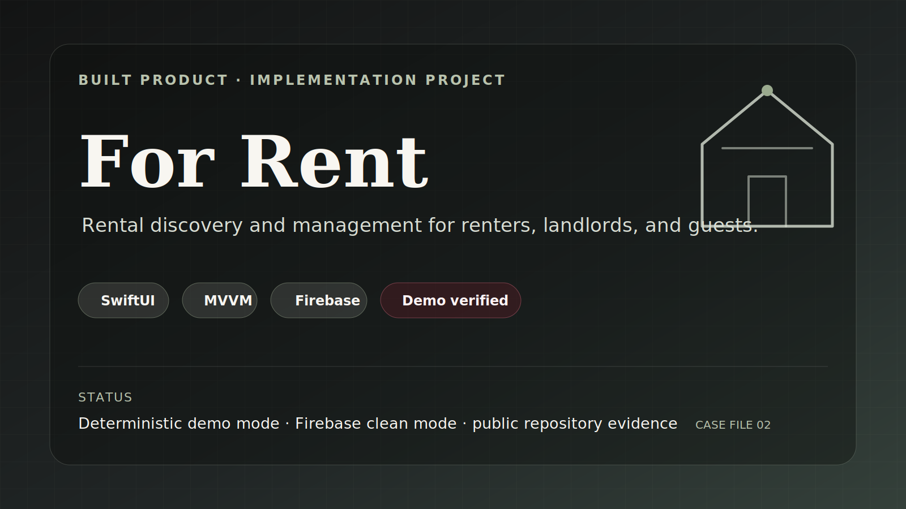
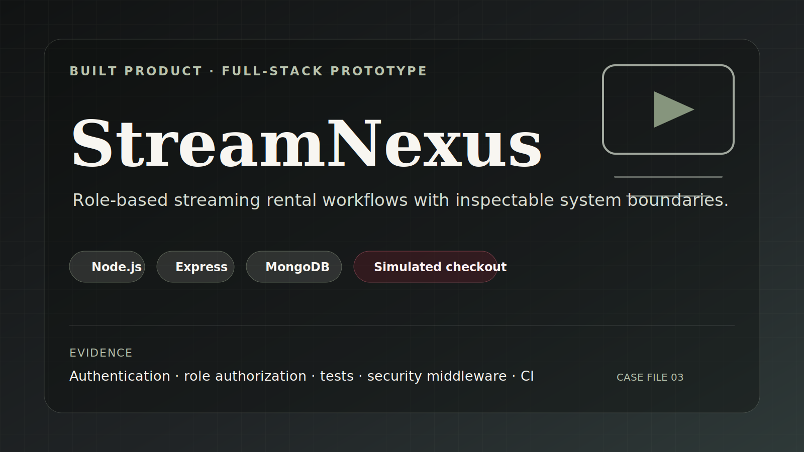
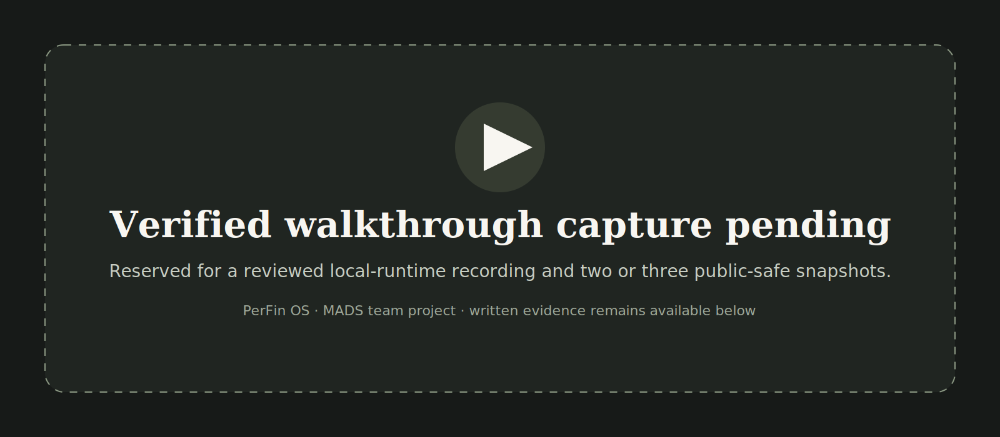
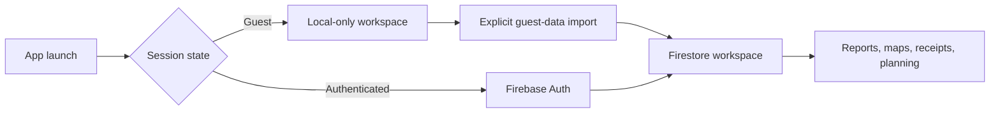
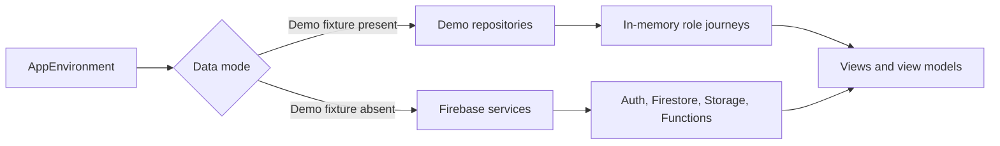
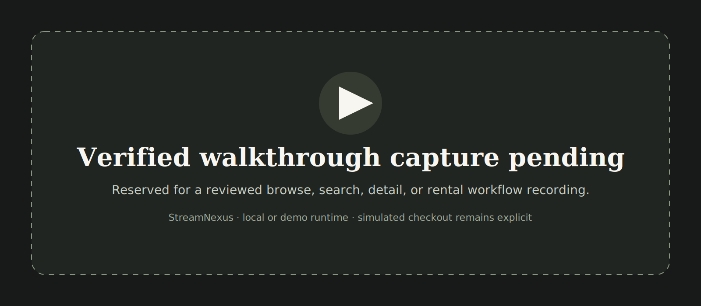
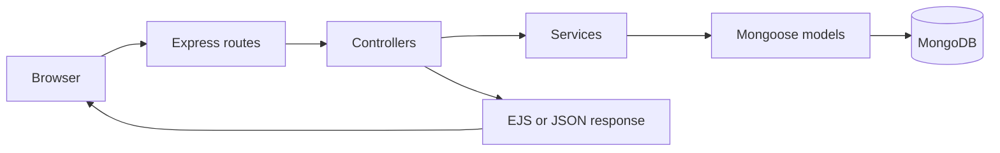

<p align="center">
  
</p>

<p align="center">
  <sub>Slow ambient motion only. The same identity content is available in the static alternative.</sub>
</p>

<details>
  <summary>View static hero</summary>
  <p align="center">
    
  </p>
</details>

<h1 align="center">Yash Kanadhia</h1>

<p align="center">
  <strong>Product Designer</strong><br />
  Toronto, Ontario, Canada
</p>

<p align="center">
  <strong>I design and build systems that connect people to outcomes.</strong>
</p>

<p align="center">
  <a href="#featured-work">Featured Work</a>
  ·
  <a href="#built-product-case-files">Built Products</a>
  ·
  <a href="#evidence-and-practice">Evidence</a>
  ·
  <a href="#live-build-console">Build Signals</a>
</p>

<p align="center">
  2 shipped projects · 1 MADS team project · 5 selected certifications
</p>

<p align="center">
  Figma · React · Swift · Firebase · Claude · Codex
</p>

I lead with product design. Development and AI-assisted execution support the work by turning product decisions into inspectable experiences with clear evidence, ownership boundaries, and known limitations.

---

## Featured work

This staged release focuses on three built products. Product-design studies and the Zeref case file are parked until their next review cycle. The existing hero remains unchanged during this phase.

### [PerFin OS](#perfin-os)

<a href="#perfin-os">
  
</a>

**MADS final team project** · React Native · Firebase  
**Team:** Yash Kanadhia, Alexis Gorospe, and Sarmad Tariq  
A personal-finance system covering expenses, budgets, receipt organization, spending maps, reports, and planning workflows across guest and authenticated experiences.

### [For Rent](#for-rent)

<a href="#for-rent">
  
</a>

**Implementation project** · SwiftUI · MVVM · Firebase  
A Canadian long-term rental marketplace with renter, landlord, and guest journeys, deterministic demo data, and a separate Firebase-backed clean mode.

### [StreamNexus](#streamnexus)

<a href="#streamnexus">
  
</a>

**Full-stack prototype** · Node.js · Express · MongoDB  
A role-based streaming-rental product with separate administrator and streamer journeys, persistent data, security middleware, testing, and simulated checkout.

---

## Built product case files

### PerFin OS

**Role and ownership:** MADS final team project by Yash Kanadhia, Alexis Gorospe, and Sarmad Tariq. This profile does not imply solo ownership.  
**Platform:** React Native, TypeScript, Firebase, Expo, Cloudflare Worker boundaries  
**Verified status:** Development branch and reviewed contribution evidence available  
**Product outcome:** Organizes personal-finance workflows across local guest and authenticated cloud workspaces.

<details>
  <summary><strong>Open PerFin OS case file</strong></summary>

  <p align="center">
    
  </p>

#### Problem

Expense tracking, budgeting, receipt organization, maps, reports, and planning can fragment into separate tools and unclear data boundaries. PerFin OS brings those workflows into one mobile product while distinguishing local guest use from authenticated cloud use.

#### Role and ownership

PerFin OS is collaborative work by **Yash Kanadhia, Alexis Gorospe, and Sarmad Tariq**.

Selected contribution evidence includes:

- Separating session and authentication ownership from finance-state management in [PF-165](https://github.com/SarmadTariq/PerfinOS/pull/69)
- Standardizing shared theme-token use across light and dark interfaces in [PF-164](https://github.com/SarmadTariq/PerfinOS/pull/68)
- Splitting Firebase client, authentication, paths, and legacy storage into clearer service boundaries in [PF-161](https://github.com/SarmadTariq/PerfinOS/pull/55)
- Improving insights, analytics, reports, privacy disclosures, and supporting interface behaviour through reviewed branches

#### Key workflow

1. An unauthenticated user enters a local-only guest workspace.
2. The user records expenses, budgets, goals, maps, analytics, and reports locally.
3. Account creation or login enables an explicit import into the authenticated workspace.
4. Firebase Auth and Firestore own cloud identity and synchronized finance data.
5. Authenticated-only receipt and planning features remain behind service boundaries.

#### System map



#### Design and technical system

- Login-first routing with separate guest and authenticated states
- Centralized validation for money, location, receipts, and transactions
- Aggregate-only AI payloads when configured, with deterministic fallback
- Service boundaries for authentication, finance state, storage, maps, and Worker proxies

#### Evidence

[Development branch](https://github.com/SarmadTariq/PerfinOS/tree/dev) · [Project README](https://github.com/SarmadTariq/PerfinOS/blob/dev/README.md) · [PF-165](https://github.com/SarmadTariq/PerfinOS/pull/69) · [PF-164](https://github.com/SarmadTariq/PerfinOS/pull/68) · [PF-161](https://github.com/SarmadTariq/PerfinOS/pull/55)

#### Known limitations

- The product does not connect to bank accounts or process payments.
- It does not provide legal, tax, banking, or investment advice.
- Receipt, Places, and AI service integrations require configured backend services.
- Public runtime media remains pending team, privacy, and capture review.

[↑ Return to featured work](#featured-work)

</details>

---

### For Rent

**Role:** Product and SwiftUI implementation  
**Ownership:** Public implementation repository under Yash Kanadhia  
**Platform:** SwiftUI, MVVM, Firebase  
**Verified status:** Deterministic offline demo mode and documented Firebase clean mode  
**Product outcome:** Supports rental discovery, saved listings, viewing inquiries, and landlord listing management across role-specific journeys.

<details>
  <summary><strong>Open For Rent case file</strong></summary>

  <p align="center">
    
  </p>

#### Problem

Rental discovery requires different journeys for guests, renters, and landlords. The product needs to preserve listing context, protect sensitive location information, and make listing and inquiry states understandable.

#### Product contribution

- Canada-wide rental discovery with search and maximum-rent filtering
- Guest browsing with protected actions that preserve listing context
- Saved listings and viewing inquiries for renters
- Listing creation, editing, publishing, pausing, and inquiry review for landlords
- Shared feedback, validation, loading, empty, and error states
- Dynamic Type, Reduce Motion support, and Apple-native interaction patterns

#### Key workflow

1. A guest browses deterministic Canadian listings.
2. Protected actions preserve the current listing context.
3. A renter saves a listing or creates a viewing inquiry.
4. A landlord manages listing lifecycle and reviews inquiry status.
5. The app selects demo repositories or Firebase services through the startup environment.

#### System map



#### Design and technical system

- Feature-oriented MVVM
- Deterministic demo data with in-memory mutations and reset control
- Separate Firebase-backed clean mode
- Callable Functions for publishing and inquiry-state changes
- Security rules that block role escalation and direct inquiry-state updates

#### Evidence

[Repository](https://github.com/kanadhiayash/forrent-swiftui-firebase-ios) · [Architecture](https://github.com/kanadhiayash/forrent-swiftui-firebase-ios/blob/main/docs/architecture.md) · [Product documentation](https://github.com/kanadhiayash/forrent-swiftui-firebase-ios/blob/main/PRODUCT.md) · [Testing and verification](https://github.com/kanadhiayash/forrent-swiftui-firebase-ios/blob/main/docs/05_TESTING_AND_VERIFICATION.md)

#### Known limitations

- The repository does not claim an App Store release.
- It does not claim a deployed production backend.
- Demo mutations reset on relaunch and are never uploaded to Firebase.
- Public workflow media remains pending verified capture.

[↑ Return to featured work](#featured-work)

</details>

---

### StreamNexus

**Role:** Full-stack product implementation  
**Ownership:** Public repository under Yash Kanadhia  
**Platform:** Node.js, Express, EJS, MongoDB  
**Verified status:** Local and demo-ready documentation with automated checks  
**Product outcome:** Models administrator and streamer workflows across catalog management, discovery, shortlist, rental, and simulated completion.

<details>
  <summary><strong>Open StreamNexus case file</strong></summary>

  <p align="center">
    
  </p>

#### Problem

A streaming-rental prototype needs distinct administrator and customer journeys, persistent catalog and rental data, clear role authorization, and inspectable behaviour without implying production streaming or payment infrastructure.

#### Product contribution

- Administrator catalog and rental-capacity workflows
- Streamer signup, browse, search, filter, detail, shortlist, rental, and completion flows
- Session authentication and role authorization
- MongoDB persistence for users, content, rentals, and session data
- Security middleware, integration tests, dependency audit, secret scanning, and CI

#### Key workflow

1. A streamer signs in or creates an account.
2. The streamer browses, searches, and filters the catalog.
3. Detail views support shortlist and rental decisions.
4. Rental completion remains a simulated portfolio workflow.
5. Administrators manage catalog content and inspect rental activity.

#### System map



#### Design and technical system

- Compact MVC and service boundaries
- Server-rendered EJS interface
- Auth, role, CSRF, rate-limit, and error middleware
- Supertest integration coverage with in-memory MongoDB
- Documented simulated checkout and local-only demo credentials

#### Evidence

[Repository](https://github.com/kanadhiayash/streamnexus) · [Architecture](https://github.com/kanadhiayash/streamnexus/blob/main/docs/architecture.md) · [User flows](https://github.com/kanadhiayash/streamnexus/blob/main/docs/user-flows.md) · [Security review](https://github.com/kanadhiayash/streamnexus/blob/main/docs/security/security-review.md)

#### Known limitations

- StreamNexus is a portfolio prototype, not a production OTT platform.
- Checkout and rental completion are simulated.
- It does not provide real payment processing, media playback, subscriptions, production identity, or compliance certification.
- Public runtime screenshots and walkthrough media remain pending verified capture.

[↑ Return to featured work](#featured-work)

</details>

---

## Evidence and practice

| Area | Working evidence |
|---|---|
| Product design | Product framing, role-specific journeys, information architecture, interaction states, UX writing, and explicit limitations |
| Inclusive design | Dynamic Type, Reduce Motion, validation, error recovery, empty states, responsive reading order, and descriptive alternatives |
| Mobile products | SwiftUI, React Native, Expo, Firebase |
| Web products | Node.js, Express, EJS, MongoDB |
| AI-assisted execution | Claude, Codex, structured context, reviewable changes, evaluation, and guarded workflows |
| Delivery | Reviewable branches, pull requests, CI, tests, dependency review, documentation, link checks, and secret scanning |

```text
Understand the product problem
→ inspect evidence, ownership, and constraints
→ define the smallest complete change
→ design and implement through a reviewable branch
→ test and verify
→ document decisions, limitations, and remaining risks
```

---

## Live build console

### Latest writing

<!-- DYNAMIC:WRITING:START -->
- [View all writing on Substack](https://substack.com/@yashkanadhia)
<!-- DYNAMIC:WRITING:END -->

### Selected build signals

<!-- DYNAMIC:SIGNALS:START -->
- **PerFin OS:** [PR #69: extract session and authentication ownership](https://github.com/SarmadTariq/PerfinOS/pull/69)
- **For Rent:** [Testing and verification matrix](https://github.com/kanadhiayash/forrent-swiftui-firebase-ios/blob/main/docs/05_TESTING_AND_VERIFICATION.md)
<!-- DYNAMIC:SIGNALS:END -->

These sections update only through a reviewable automation pull request. Source failures preserve the last reviewed content.

---

## Selected credentials

- **AI Fluency: Framework & Foundations**, Anthropic, June 2026
- **Claude Code in Action**, Anthropic, June 2026
- **Introduction to Claude Cowork**, Anthropic, June 2026
- **Claude Code 101**, Anthropic, June 2026
- **Scrum Fundamentals Certified**, SCRUMstudy, June 2026

Additional completed credentials, including **Claude 101**, are listed on [LinkedIn](https://www.linkedin.com/in/yashkanadhia).

---

## Connect

[Connect on LinkedIn](https://www.linkedin.com/in/yashkanadhia) · [Read on Substack](https://substack.com/@yashkanadhia)

Open to Product Designer, AI Product Designer, Design Technologist, and product-engineering-adjacent opportunities in Canada.
