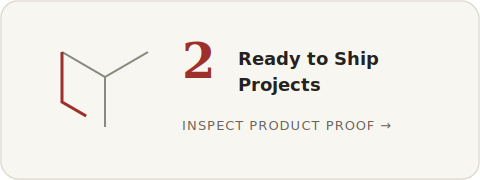
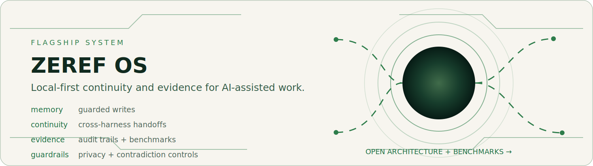
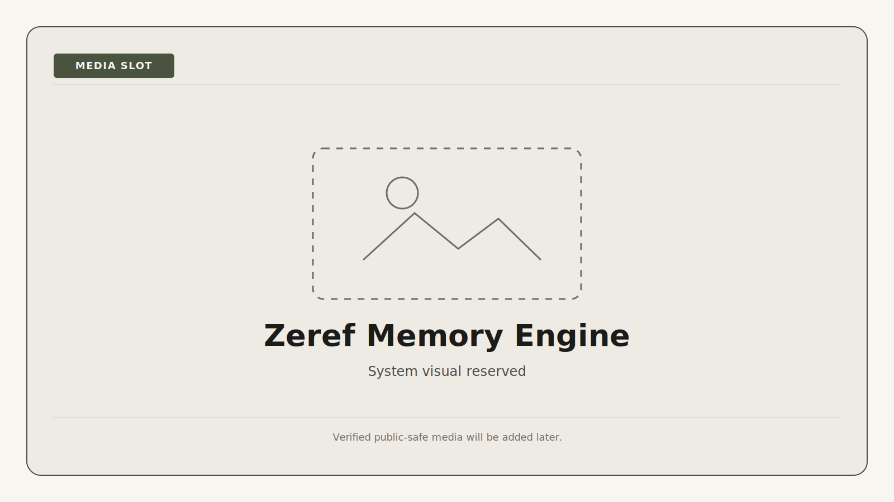
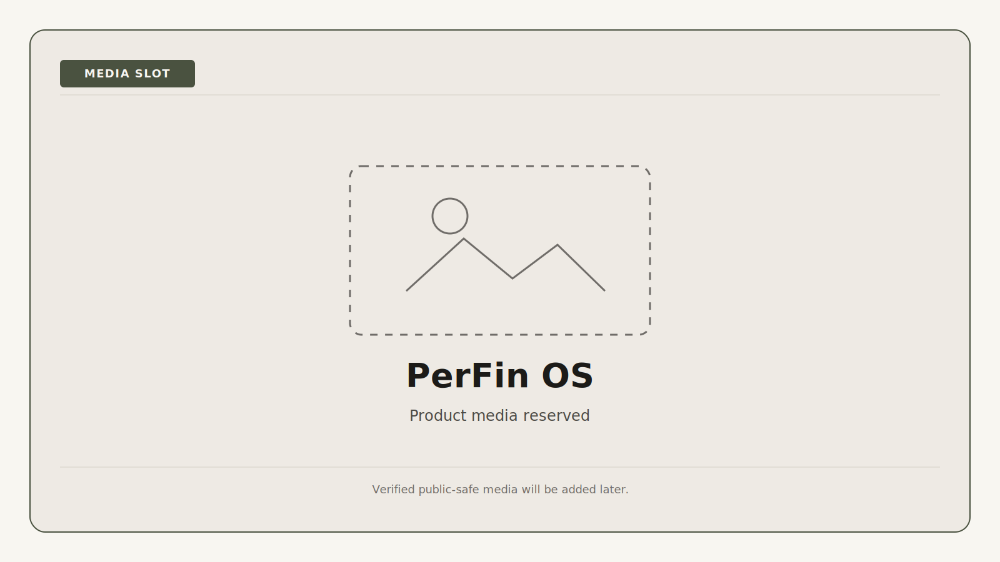
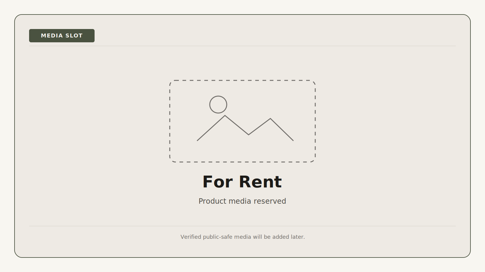
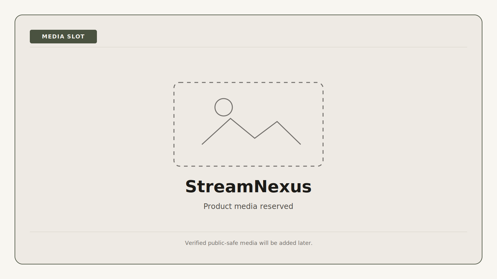

  

  <em>改善・構築・守る · Improve · Build · Protect.</em> 
  Light-first ambient motion. Select the hero to open the 60-second profile.

  
View static hero

  

    
  

<h1 align="center">Yash Kanadhia</h1>

  <strong>Product Designer</strong> 
  Toronto, Ontario, Canada

  <strong>I design and build systems that connect people to outcomes.</strong>

  <a href="#60-second-profile">60-second profile</a>
  ·
  <a href="#deep-evidence">Deep evidence</a>
  ·
  <a href="#evidence-map">Evidence map</a>
  ·
  <a href="#current-signals">Current signals</a>
  ·
  <a href="#connect">Connect</a>

  Figma · Linear · Notion · React · SwiftUI · Firebase · Claude · Codex · GitHub

<!-- Release-gate compatibility: Figma · React · Swift · Firebase · Claude · Codex -->

<table>
  <tr>
    <td width="33%" align="center">
      
    </td>
    <td width="33%" align="center">
      
    </td>
    <td width="33%" align="center">
      
    </td>
  </tr>
</table>

---

## 60-second profile

I lead with product design and use implementation, architecture, and AI-assisted delivery to make product decisions inspectable. My work spans mobile and web products, local-first AI systems, accessibility, testing, documentation, and reviewable delivery.

### What I bring

- **Product judgment:** problem framing, workflows, information architecture, interaction states, and clear product boundaries.
- **Technical range:** SwiftUI, React Native, Node.js, Firebase, MongoDB, and system-level AI workflows.
- **Delivery discipline:** short branches, pull requests, tests, security checks, evidence trails, and explicit limitations.

### Selected proof

- **[Zeref Memory Engine](https://github.com/kanadhiayash/zeref-memory-engine)** · Local-first context and memory for AI-assisted work. [Architecture](https://github.com/kanadhiayash/zeref-memory-engine#architecture) · [Benchmarks](https://github.com/kanadhiayash/zeref-memory-engine/blob/main/docs/BENCHMARK_REPORT.md)
- **[PerFin OS](https://github.com/SarmadTariq/PerfinOS/tree/dev)** · MADS final team project covering personal-finance workflows across guest and authenticated workspaces. [Selected contribution](https://github.com/SarmadTariq/PerfinOS/pull/69)
- **[For Rent](https://github.com/kanadhiayash/forrent-swiftui-firebase-ios)** · SwiftUI rental marketplace with renter, landlord, guest, demo, and Firebase-backed paths. [Product documentation](https://github.com/kanadhiayash/forrent-swiftui-firebase-ios/blob/main/PRODUCT.md)
- **[StreamNexus](https://github.com/kanadhiayash/streamnexus)** · Full-stack streaming-rental prototype with administrator and customer workflows. [Architecture](https://github.com/kanadhiayash/streamnexus/blob/main/docs/architecture.md)

---

## Deep evidence

The visible profile stays concise. Open a drawer to inspect ownership, decisions, quality evidence, and known boundaries.

### Flagship system

#### Zeref Memory Engine

Local-first memory for AI-assisted work across multiple tools, with guarded writes, explicit evidence states, privacy controls, audit trails, and deterministic release checks.

  
<strong>Inspect Zeref evidence</strong>

  

    
  

  **Ownership:** Public independent project under Yash Kanadhia, covering product direction, system architecture, reference implementation, documentation, and evaluation.

  **What it demonstrates**

  - A canonical project-memory contract shared across AI harnesses.
  - Guarded memory writes with fact, evidence, privacy, and contradiction controls.
  - Cross-harness handoffs, append-only audit traces, and deterministic local benchmarks.
  - Clear non-claims: Zeref is not a hosted service, model provider, vector database, or substitute for human review.

  **Evidence:** [Repository](https://github.com/kanadhiayash/zeref-memory-engine) · [Canonical specification](https://github.com/kanadhiayash/zeref-memory-engine/blob/main/AGENTS.md) · [Architecture](https://github.com/kanadhiayash/zeref-memory-engine#architecture) · [Benchmark report](https://github.com/kanadhiayash/zeref-memory-engine/blob/main/docs/BENCHMARK_REPORT.md) · [Security](https://github.com/kanadhiayash/zeref-memory-engine/blob/main/SECURITY.md)

  [↑ Return to the 60-second profile](#60-second-profile)

### Selected products

  
<strong>Inspect PerFin OS contribution evidence</strong>

  

    
  

  **Role and ownership:** MADS final team project by **Yash Kanadhia, Alexis Gorospe, and Sarmad Tariq**. This profile does not imply solo ownership.

  **Selected contribution evidence**

  - Session and authentication ownership separated from finance-state management in [PF-165](https://github.com/SarmadTariq/PerfinOS/pull/69).
  - Shared theme-token use standardized across light and dark interfaces in [PF-164](https://github.com/SarmadTariq/PerfinOS/pull/68).
  - Firebase client, authentication, paths, and legacy storage split into clearer boundaries in [PF-161](https://github.com/SarmadTariq/PerfinOS/pull/55).

  **Known boundary:** The product does not connect to bank accounts or process payments. Public runtime media remains subject to team and privacy review.

  **Evidence:** [Development branch](https://github.com/SarmadTariq/PerfinOS/tree/dev) · [Project README](https://github.com/SarmadTariq/PerfinOS/blob/dev/README.md)

  [↑ Return to the 60-second profile](#60-second-profile)

  
<strong>Inspect For Rent product evidence</strong>

  

    
  

  **Role:** Product and SwiftUI implementation.

  **What it demonstrates**

  - Renter, landlord, and guest journeys with context-preserving protected actions.
  - Feature-oriented MVVM with deterministic demo repositories and a separate Firebase clean mode.
  - Dynamic Type, Reduce Motion, validation, loading, empty, and error-state coverage.

  **Known boundary:** The repository does not claim an App Store release or a deployed production backend.

  **Evidence:** [Repository](https://github.com/kanadhiayash/forrent-swiftui-firebase-ios) · [Architecture](https://github.com/kanadhiayash/forrent-swiftui-firebase-ios/blob/main/docs/architecture.md) · [Testing and verification](https://github.com/kanadhiayash/forrent-swiftui-firebase-ios/blob/main/docs/05_TESTING_AND_VERIFICATION.md)

  [↑ Return to the 60-second profile](#60-second-profile)

  
<strong>Inspect StreamNexus product evidence</strong>

  

    
  

  **Role:** Full-stack product implementation.

  **What it demonstrates**

  - Administrator and customer journeys across catalog, discovery, shortlist, rental, and completion.
  - Express routes, controllers, services, Mongoose models, and server-rendered EJS interfaces.
  - Authentication, role authorization, CSRF protection, rate limiting, integration tests, dependency review, and secret scanning.

  **Known boundary:** StreamNexus is a portfolio prototype, not a production OTT platform. Checkout and rental completion are simulated.

  **Evidence:** [Repository](https://github.com/kanadhiayash/streamnexus) · [Architecture](https://github.com/kanadhiayash/streamnexus/blob/main/docs/architecture.md) · [User flows](https://github.com/kanadhiayash/streamnexus/blob/main/docs/user-flows.md) · [Security review](https://github.com/kanadhiayash/streamnexus/blob/main/docs/security/security-review.md)

  [↑ Return to the 60-second profile](#60-second-profile)

---

## Evidence map

| Capability | Inspectable proof |
|---|---|
| Product thinking | Role-specific journeys, information architecture, interaction states, product boundaries, and project documentation |
| System architecture | [Zeref architecture](https://github.com/kanadhiayash/zeref-memory-engine#architecture), [For Rent architecture](https://github.com/kanadhiayash/forrent-swiftui-firebase-ios/blob/main/docs/architecture.md), and [StreamNexus architecture](https://github.com/kanadhiayash/streamnexus/blob/main/docs/architecture.md) |
| Quality and security | [Zeref benchmarks](https://github.com/kanadhiayash/zeref-memory-engine/blob/main/docs/BENCHMARK_REPORT.md), [For Rent verification](https://github.com/kanadhiayash/forrent-swiftui-firebase-ios/blob/main/docs/05_TESTING_AND_VERIFICATION.md), and [StreamNexus security review](https://github.com/kanadhiayash/streamnexus/blob/main/docs/security/security-review.md) |
| Collaboration | PerFin OS team attribution and reviewed pull-request evidence |
| Delivery | Reviewable branches, pull requests, CI, documentation, link validation, and explicit release boundaries |

---

## How I work

1. **Frame the product problem** and identify users, constraints, ownership, and evidence gaps.
2. **Design the smallest complete system** with clear workflows, states, boundaries, and decision records.
3. **Build through reviewable changes** using branches, pull requests, tests, security checks, and documentation.
4. **State what remains unknown** rather than presenting prototypes, simulations, or placeholders as completed production proof.

---

## Current signals

### Latest writing

<!-- DYNAMIC:WRITING:START -->
- [View all writing on Substack](https://substack.com/@yashkanadhia)
<!-- DYNAMIC:WRITING:END -->

### Selected build signals

<!-- DYNAMIC:SIGNALS:START -->
- **PerFin OS:** [PR #69: extract session and authentication ownership](https://github.com/SarmadTariq/PerfinOS/pull/69)
- **For Rent:** [Testing and verification matrix](https://github.com/kanadhiayash/forrent-swiftui-firebase-ios/blob/main/docs/05_TESTING_AND_VERIFICATION.md)
<!-- DYNAMIC:SIGNALS:END -->

These sections update only through a reviewable automation pull request. Source failures preserve the last reviewed content.

---

## Selected credentials

- **Anthropic:** AI Fluency: Framework & Foundations · Claude Code in Action · Introduction to Claude Cowork · Claude Code 101
- **SCRUMstudy:** Scrum Fundamentals Certified

Additional completed credentials are listed on [LinkedIn](https://www.linkedin.com/in/yashkanadhia).

---

## Connect

[LinkedIn](https://www.linkedin.com/in/yashkanadhia) · [Substack](https://substack.com/@yashkanadhia) · [GitHub repositories](https://github.com/kanadhiayash?tab=repositories)

Open to Product Designer, AI Product Designer, Design Technologist, UX Engineer, and product-focused front-end opportunities in Canada.
