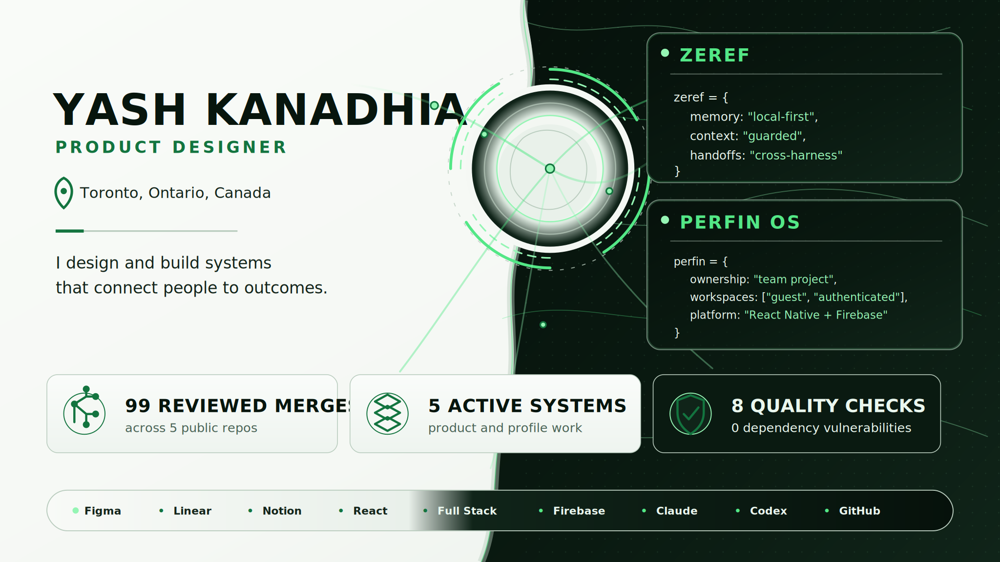
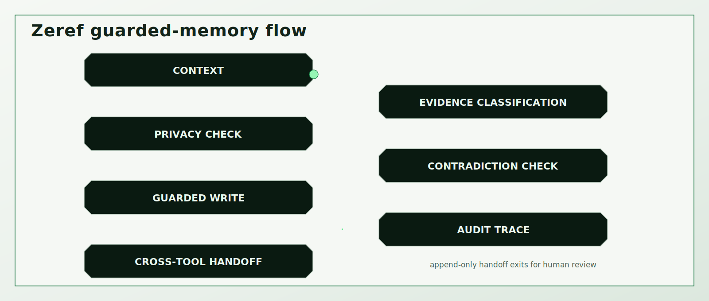
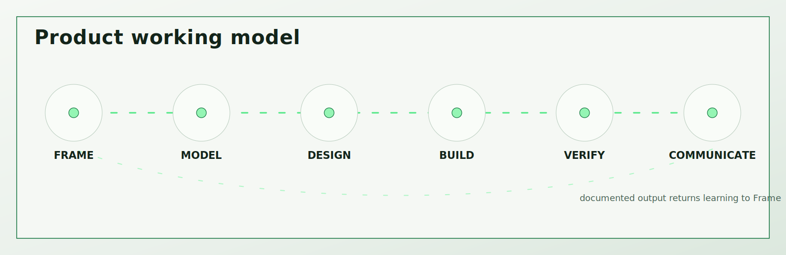
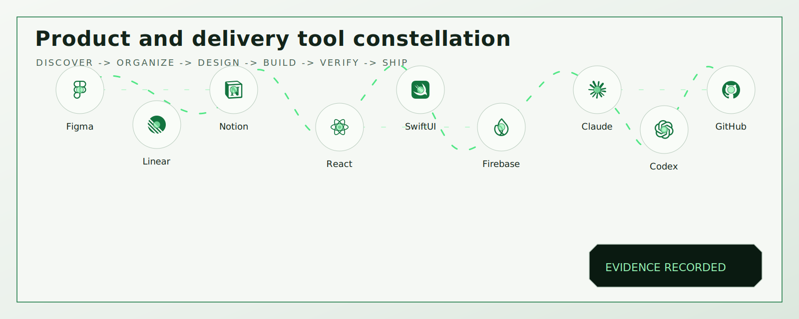

<!-- =========================================================
     YASH KANADHIA · GITHUB PROFILE
     VISUAL SYSTEM: MINIMAL ALIENTECH
     Banner content and information architecture are locked.
     ========================================================= -->

  

  
View static banner

  

    
  

  <a href="#overview">Overview</a>
  ·
  <a href="#selected-work">Selected Work</a>
  ·
  <a href="#capabilities">Capabilities</a>
  ·
  <a href="#evidence-map">Evidence</a>
  ·
  <a href="#how-i-work">How I Work</a>
  ·
  <a href="#product-and-delivery-stack">Stack</a>
  ·
  <a href="#current-signals">Current Signals</a>
  ·
  <a href="#connect">Connect</a>

---

## Overview

I’m a **Product Designer** based in Toronto, working across product strategy, UX systems, mobile and web implementation, and AI-assisted delivery.

I’m strongest where an ambiguous workflow needs to become understandable, testable, and ready for a team to build.

I don’t treat design as a visual layer added after product decisions are made. I work through the product model, user journeys, information architecture, interaction states, accessibility, implementation constraints, ownership, and evidence required to support each decision.

> **I design and build systems that connect people to outcomes.**

### What I bring

| Product judgment | System thinking | Delivery discipline |
|---|---|---|
| Problem framing, user journeys, information architecture, interaction states, and product boundaries. | Permissions, data relationships, failure states, accessibility, architecture, and operational consequences. | Reviewable changes, testing, security checks, documentation, evidence trails, and explicit limitations. |

### Working across the seam

I lead with product design and use implementation fluency to make decisions more realistic, communication more precise, and delivery easier to inspect.

My work spans:

- Product strategy and UX systems
- Interaction design and accessibility
- SwiftUI and React-based products
- Firebase and application-service boundaries
- AI-assisted research, implementation, review, and documentation
- Repository operations, pull requests, testing, and release evidence

---

## Selected work

The profile focuses on a small number of projects with inspectable ownership, decisions, architecture, quality evidence, and known limitations.

---

## Flagship system

### Zeref Memory Engine

  

**Local-first memory and continuity for AI-assisted work.**

AI-assisted projects often lose context between tools and sessions. Decisions become difficult to verify, assumptions can quietly become facts, and private information can cross boundaries without enough control.

Zeref explores a different operating model: project memory that remains local-first, evidence-aware, privacy-conscious, and inspectable.

**Role and ownership**

Independent product direction, system architecture, reference implementation, documentation, and evaluation.

**What it demonstrates**

- A canonical project-memory contract shared across AI tools
- Guarded writes with fact, evidence, privacy, and contradiction controls
- Cross-tool handoffs with explicit context and ownership
- Append-only audit traces
- Deterministic local benchmarks and release checks
- Clear separation between implemented behavior, planned behavior, and non-goals

**Product boundary**

Zeref is not a hosted AI service, model provider, vector database, autonomous decision-maker, or replacement for human review.

**Evidence**

[Repository](https://github.com/kanadhiayash/zeref-memory-engine)
·
[Canonical specification](https://github.com/kanadhiayash/zeref-memory-engine/blob/main/AGENTS.md)
·
[Architecture](https://github.com/kanadhiayash/zeref-memory-engine#architecture)
·
[Benchmark report](https://github.com/kanadhiayash/zeref-memory-engine/blob/main/docs/BENCHMARK_REPORT.md)
·
[Security](https://github.com/kanadhiayash/zeref-memory-engine/blob/main/SECURITY.md)

  
<strong>Inspect Zeref evidence</strong>

  

    
  

  ### Product problem

  AI work becomes fragile when context, decisions, evidence, and privacy rules exist only inside individual conversations or tools.

  ### System response

  Zeref treats memory as governed project infrastructure rather than an unlimited transcript.

  ### Quality model

  - Facts and assumptions remain distinct
  - Unknowns and contradictions remain visible
  - Sensitive content follows explicit privacy rules
  - Writes are guarded and auditable
  - Handoffs preserve ownership and context
  - Benchmarks test deterministic behavior

  ### Non-claims

  Zeref does not claim autonomous truth, independent judgment, hosted infrastructure, or replacement of human review.

---

## Product work

### PerFin OS

**Personal-finance workflows across guest and authenticated experiences.**

Personal-finance products contain sensitive state, multiple user conditions, and strong expectations around clarity and trust. PerFin OS explores how these workflows can remain understandable across guest and authenticated workspaces.

**Role and ownership**

Team project by **Yash Kanadhia, Alexis Gorospe, and Sarmad Tariq**.

This profile does not imply solo ownership.

**Selected contribution**

- Separated session and authentication ownership from finance-state management
- Standardized shared theme-token use across light and dark interfaces
- Clarified boundaries between Firebase setup, authentication, application paths, and legacy storage
- Contributed through reviewable pull requests with contribution-specific evidence

**Product boundary**

PerFin OS does not connect to bank accounts or process payments. Runtime media remains subject to team and privacy review.

**Evidence**

[Development branch](https://github.com/SarmadTariq/PerfinOS/tree/dev)
·
[Project README](https://github.com/SarmadTariq/PerfinOS/blob/dev/README.md)
·
[Authentication and session ownership](https://github.com/SarmadTariq/PerfinOS/pull/69)
·
[Theme-token standardization](https://github.com/SarmadTariq/PerfinOS/pull/68)
·
[Firebase boundary cleanup](https://github.com/SarmadTariq/PerfinOS/pull/55)

  
<strong>Inspect PerFin OS evidence</strong>

  

    
  

  ### Contribution focus

  - Authentication and session ownership
  - Finance-state separation
  - Shared visual tokens
  - Firebase boundaries
  - Team-safe public attribution

  ### Known limitations

  - No bank-account connection
  - No payment processing
  - Product media requires team and privacy approval

---

### For Rent

**A SwiftUI rental product supporting renter, landlord, guest, and demo journeys.**

Rental products must support different goals and permissions without losing the user’s context when an action becomes protected or unavailable.

**Role**

Product design and SwiftUI implementation.

**What it demonstrates**

- Renter, landlord, guest, and protected-action journeys
- Context-preserving authentication transitions
- Feature-oriented MVVM
- Deterministic demo repositories
- Separate Firebase clean mode
- Dynamic Type and Reduce Motion support
- Validation, loading, empty, success, and error-state coverage
- Product documentation tied to implementation behavior

**Product boundary**

The repository does not claim an App Store release or a deployed production backend.

**Evidence**

[Repository](https://github.com/kanadhiayash/forrent-swiftui-firebase-ios)
·
[Product documentation](https://github.com/kanadhiayash/forrent-swiftui-firebase-ios/blob/main/PRODUCT.md)
·
[Architecture](https://github.com/kanadhiayash/forrent-swiftui-firebase-ios/blob/main/docs/architecture.md)
·
[Testing and verification](https://github.com/kanadhiayash/forrent-swiftui-firebase-ios/blob/main/docs/05_TESTING_AND_VERIFICATION.md)

  
<strong>Inspect For Rent evidence</strong>

  

    
  

  ### Product focus

  - Role-aware journeys
  - Protected-action continuity
  - State completeness
  - Native accessibility behavior
  - Deterministic demo support

  ### Known limitations

  - No public App Store claim
  - No deployed production backend claim
  - Firebase configuration remains environment-specific

---

### StreamNexus

**A full-stack streaming-rental prototype with administrator and customer workflows.**

The product explores the wider workflow behind a streaming-rental experience, not only the customer-facing catalog.

**Role**

Full-stack product implementation.

**What it demonstrates**

- Administrator and customer journeys
- Catalog management, discovery, shortlist, rental, and completion states
- Express routes, controllers, services, and Mongoose models
- Server-rendered EJS interfaces
- Authentication and role authorization
- CSRF protection and rate limiting
- Integration testing
- Dependency review and secret scanning
- Architecture and security documentation

**Product boundary**

StreamNexus is a portfolio prototype, not a production streaming platform. Checkout and rental completion are simulated.

**Evidence**

[Repository](https://github.com/kanadhiayash/streamnexus)
·
[Architecture](https://github.com/kanadhiayash/streamnexus/blob/main/docs/architecture.md)
·
[User flows](https://github.com/kanadhiayash/streamnexus/blob/main/docs/user-flows.md)
·
[Security review](https://github.com/kanadhiayash/streamnexus/blob/main/docs/security/security-review.md)

  
<strong>Inspect StreamNexus evidence</strong>

  

    
  

  ### Product focus

  - Customer and administrator workflows
  - Catalog and rental lifecycle
  - Full-stack separation of concerns
  - Authentication and authorization
  - Security review and verification

  ### Known limitations

  - Simulated checkout
  - Simulated rental completion
  - Portfolio prototype rather than production OTT infrastructure

---

## Capabilities

### Product clarity

I translate unclear requirements into defined users, workflows, states, constraints, and product decisions.

### System thinking

I connect individual interfaces to the wider product model, including permissions, data relationships, error states, accessibility, and operational consequences.

### Design and implementation fluency

I work across Figma, React, React Native, SwiftUI, Firebase, Node.js, and AI-assisted development workflows.

That range helps me design solutions that remain coherent when they move from prototype to implementation.

### Reviewable delivery

I prefer focused changes, explicit ownership, documented tradeoffs, pull-request evidence, testing, security review, and clear release boundaries.

### AI-assisted product work

I use AI for research, exploration, implementation support, review, and documentation.

Human judgment remains responsible for product direction, evidence quality, privacy, security, and final decisions.

---

## Operating principles

| Principle | Application |
|---|---|
| **Evidence before claims** | Product status, metrics, outcomes, and capabilities should be supported by something another person can inspect. |
| **Ownership stays explicit** | Independent work, team projects, inherited systems, and shared decisions are not presented as the same kind of ownership. |
| **Prototypes stay prototypes** | A demonstration, simulation, or proof of concept is not described as a production system. |
| **Accessibility is product quality** | Accessibility belongs in workflows, content, interaction states, motion, validation, and testing. |
| **Security starts before release** | Secrets, permissions, authentication, dependencies, and input boundaries are considered during design and implementation. |
| **AI output requires judgment** | AI can accelerate work, but it cannot own truth, privacy, accountability, or final review. |

---

## Evidence map

| Capability | Inspectable proof |
|---|---|
| **Product judgment** | Role-specific journeys, information architecture, interaction states, constraints, product boundaries, and decision rationale |
| **System architecture** | Zeref, For Rent, and StreamNexus architecture documentation |
| **Design quality** | State coverage, accessibility behavior, component systems, content hierarchy, and interface rationale |
| **Engineering quality** | Tests, authentication boundaries, security review, dependency checks, and release gates |
| **Collaboration** | PerFin OS team attribution, reviewed pull requests, and contribution-specific evidence |
| **Delivery discipline** | Branches, pull requests, CI, documentation, link validation, and explicit release boundaries |
| **Communication** | READMEs, architecture documents, verification reports, case-study writing, and known limitations |

---

## How I work

  

### 1. Frame the product

Identify users, desired outcomes, constraints, ownership, evidence gaps, and the decisions that need to be made.

### 2. Model the system

Define workflows, states, information architecture, permissions, data boundaries, failure conditions, and product limitations.

### 3. Design the experience

Create the interaction model, content hierarchy, visual system, accessibility behavior, and prototypes needed to test the product.

### 4. Build through reviewable changes

Use focused branches, pull requests, documentation, tests, and security checks so decisions remain visible.

### 5. Verify the result

Test behavior, edge cases, accessibility, failure states, links, documentation, and release claims.

### 6. Communicate what remains unknown

Separate confirmed behavior from assumptions, simulations, placeholders, and planned work.

---

## Product and delivery stack

  

  <strong>Discover → Organize → Design → Build → Verify → Ship</strong>

Tools are selected according to the needs of the product, the team, and the evidence required at each stage.

Tool choice is not treated as a substitute for product judgment.

### Design and operations

<table>
  <tr>
    <td align="center" width="33%">
      <a href="./STACK.md#figma">
        
         
        <strong>Figma</strong>
      </a>
       
      Product flows, interfaces, prototypes, systems, and handoff.
    </td>
    <td align="center" width="33%">
      <a href="./STACK.md#linear">
        
         
        <strong>Linear</strong>
      </a>
       
      Issues, priorities, delivery planning, and execution tracking.
    </td>
    <td align="center" width="33%">
      <a href="./STACK.md#notion">
        
         
        <strong>Notion</strong>
      </a>
       
      Supporting notes, references, planning, and project knowledge.
    </td>
  </tr>
</table>

### Build and platform

<table>
  <tr>
    <td align="center" width="33%">
      <a href="./STACK.md#react">
        
         
        <strong>React</strong>
      </a>
       
      Web interfaces, component systems, and product implementation.
    </td>
    <td align="center" width="33%">
      <a href="./STACK.md#swiftui">
        
         
        <strong>SwiftUI</strong>
      </a>
       
      Native Apple interfaces, interaction behavior, and accessibility.
    </td>
    <td align="center" width="33%">
      <a href="./STACK.md#firebase">
        
         
        <strong>Firebase</strong>
      </a>
       
      Authentication, application data, storage, and managed services.
    </td>
  </tr>
</table>

### AI and delivery

<table>
  <tr>
    <td align="center" width="33%">
      <a href="./STACK.md#claude">
        
         
        <strong>Claude</strong>
      </a>
       
      Product exploration, research, critique, reasoning, and documentation.
    </td>
    <td align="center" width="33%">
      <a href="./STACK.md#codex">
        
         
        <strong>Codex</strong>
      </a>
       
      Implementation, testing, debugging, refactoring, and verification.
    </td>
    <td align="center" width="33%">
      <a href="./STACK.md#github">
        
         
        <strong>GitHub</strong>
      </a>
       
      Source control, review, CI, documentation, releases, and public proof.
    </td>
  </tr>
</table>

  <a href="./STACK.md"><strong>Inspect the complete product and delivery stack →</strong></a>

---

## Current signals

### Latest writing

<!-- DYNAMIC:WRITING:START -->
- [View all writing on Substack](https://substack.com/@yashkanadhia)
<!-- DYNAMIC:WRITING:END -->

### Recent build evidence

<!-- DYNAMIC:SIGNALS:START -->
- **PerFin OS:** [Extract session and authentication ownership](https://github.com/SarmadTariq/PerfinOS/pull/69)
- **For Rent:** [Testing and verification matrix](https://github.com/kanadhiayash/forrent-swiftui-firebase-ios/blob/main/docs/05_TESTING_AND_VERIFICATION.md)
<!-- DYNAMIC:SIGNALS:END -->

These sections update only through a reviewable automation pull request.

When an external source fails, the profile preserves the last reviewed content instead of publishing incomplete or unverified information.

---

## Selected credentials

### Anthropic

- AI Fluency: Framework & Foundations
- Claude Code in Action
- Introduction to Claude Cowork
- Claude Code 101

### SCRUMstudy

- Scrum Fundamentals Certified

Additional completed credentials are listed on [LinkedIn](https://www.linkedin.com/in/yashkanadhia).

---

## Let’s work on a difficult product problem

I’m interested in products where clear workflows, strong interaction design, technical understanding, and responsible AI-assisted delivery need to meet.

Open to conversations around:

**Product Design**
·
**AI Product Design**
·
**Design Technology**
·
**UX Engineering**
·
**Product-focused Front-End Work**

Based in Toronto and open to opportunities across Canada.

  <a href="https://www.linkedin.com/in/yashkanadhia"><strong>LinkedIn</strong></a>
  ·
  <a href="https://substack.com/@yashkanadhia"><strong>Substack</strong></a>
  ·
  <a href="https://github.com/kanadhiayash?tab=repositories"><strong>Repositories</strong></a>

  <strong>Bring the problem, the constraints, and the evidence. We’ll make the system clearer.</strong>

