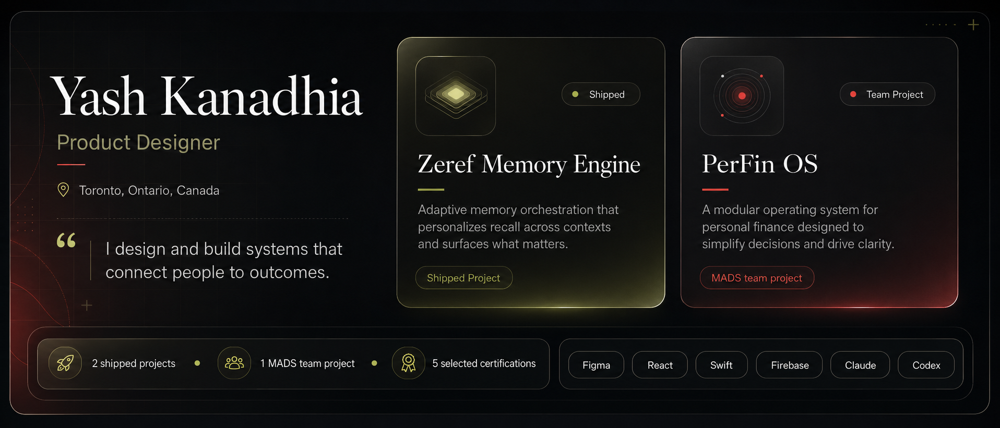
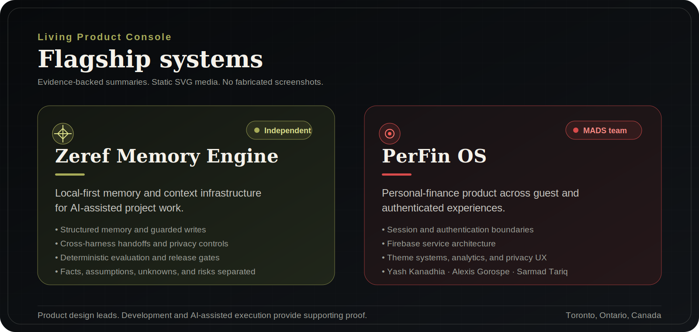
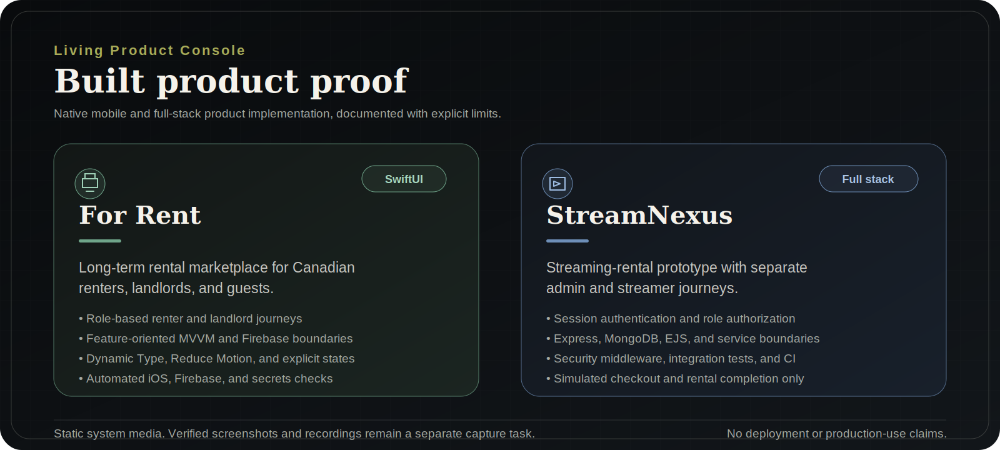
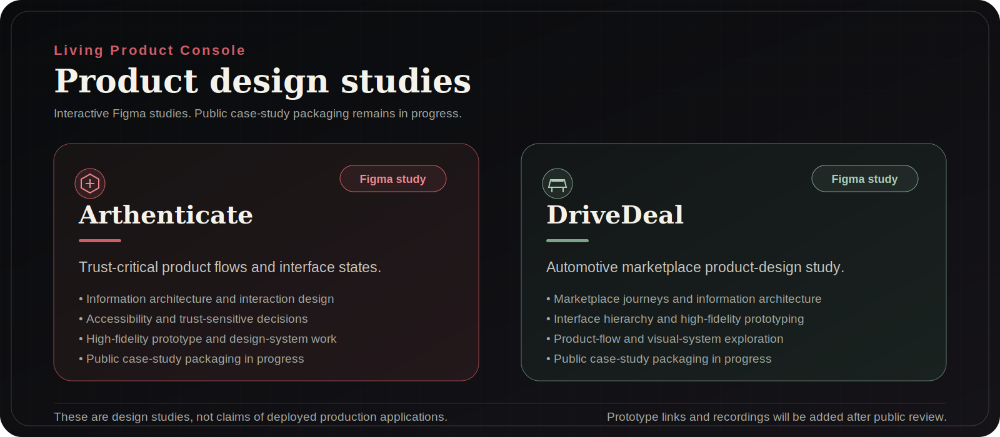

<p align="center">
  
</p>

<h1 align="center">Yash Kanadhia</h1>

<p align="center">
  <strong>Product Designer</strong><br />
  Toronto, Ontario, Canada
</p>

<p align="center">
  <strong>I design and build systems that connect people to outcomes.</strong>
</p>

<p align="center">
  <a href="#selected-work">Explore selected work ↓</a>
  ·
  <a href="https://www.linkedin.com/in/yashkanadhia">Connect on LinkedIn ↗</a>
  ·
  <a href="https://substack.com/@yashkanadhia">Read on Substack ↗</a>
</p>

<p align="center">
  2 shipped projects · 1 MADS team project · 5 selected certifications
</p>

<p align="center">
  Figma · React · Swift · Firebase · Claude · Codex
</p>

I lead with product design. Development and AI-assisted execution support the work by turning product decisions into working, inspectable experiences with clear evidence and ownership boundaries.

---

## Selected work

### Flagship systems

<p align="center">
  
</p>

#### [Zeref Memory Engine](https://github.com/kanadhiayash/zeref-memory-engine)

**Independent project**

A local-first memory and context engine for AI-assisted project work. Zeref keeps decisions, constraints, risks, evidence, and handoffs inside the project instead of forcing every new AI session to start without context.

**What it demonstrates**

- Product framing for a recurring AI-workflow problem
- Local-first and privacy-first architecture
- Structured memory, guarded writes, and cross-harness handoffs
- Deterministic evaluation, release checks, and public-claim controls
- Documentation that separates facts, assumptions, unknowns, and risks

**Evidence**

[Repository](https://github.com/kanadhiayash/zeref-memory-engine) · [Canonical specification](https://github.com/kanadhiayash/zeref-memory-engine/blob/main/AGENTS.md) · [Benchmark report](https://github.com/kanadhiayash/zeref-memory-engine/blob/main/docs/BENCHMARK_REPORT.md) · [Release gates](https://github.com/kanadhiayash/zeref-memory-engine/blob/main/docs/RELEASE_GATES.md)

---

#### [PerFin OS](https://github.com/SarmadTariq/PerfinOS/tree/dev)

**MADS final team project**  
**Team:** Yash Kanadhia, Alexis Gorospe, and Sarmad Tariq

A React Native personal-finance product covering expenses, budgets, receipt organization, location-aware spending, reports, and planning workflows across guest and authenticated experiences.

**Selected contributions**

- Separated session and authentication ownership from finance-state management in [PF-165](https://github.com/SarmadTariq/PerfinOS/pull/69)
- Standardized shared theme-token use across light and dark interfaces in [PF-164](https://github.com/SarmadTariq/PerfinOS/pull/68)
- Split Firebase client, authentication, paths, and legacy storage into clearer service boundaries in [PF-161](https://github.com/SarmadTariq/PerfinOS/pull/55)
- Improved insights, analytics, reports, privacy disclosures, and supporting interface behaviour through reviewed feature and fix branches

**Ownership note**

PerFin OS is collaborative work. This profile does not imply solo ownership.

[Development branch](https://github.com/SarmadTariq/PerfinOS/tree/dev) · [Project README](https://github.com/SarmadTariq/PerfinOS/blob/dev/README.md)

---

### Built product proof

<p align="center">
  
</p>

#### [For Rent](https://github.com/kanadhiayash/forrent-swiftui-firebase-ios)

A SwiftUI long-term rental marketplace for Canadian renters, landlords, and guests. The repository demonstrates role-based journeys, feature-oriented MVVM, deterministic demo data, Firebase boundaries, accessibility support, explicit interface states, and automated quality gates.

[Repository](https://github.com/kanadhiayash/forrent-swiftui-firebase-ios) · [Architecture](https://github.com/kanadhiayash/forrent-swiftui-firebase-ios/blob/main/docs/architecture.md) · [Testing and verification](https://github.com/kanadhiayash/forrent-swiftui-firebase-ios/blob/main/docs/05_TESTING_AND_VERIFICATION.md)

#### [StreamNexus](https://github.com/kanadhiayash/streamnexus)

A full-stack streaming-rental prototype with separate admin and streamer journeys, role authorization, session authentication, MongoDB persistence, security middleware, integration tests, and CI. Checkout and rental completion remain simulated product flows.

[Repository](https://github.com/kanadhiayash/streamnexus) · [Architecture](https://github.com/kanadhiayash/streamnexus/blob/main/docs/architecture.md) · [User flows](https://github.com/kanadhiayash/streamnexus/blob/main/docs/user-flows.md)

---

### Product design studies

<p align="center">
  
</p>

#### Arthenticate

An interactive Figma product-design study focused on trust-critical product flows, information architecture, interface states, accessibility, and high-fidelity prototyping.

**Public case-study packaging is in progress.**

#### DriveDeal

An interactive Figma product-design study for an automotive marketplace, covering product flows, marketplace information architecture, interface design, and high-fidelity prototyping.

**Public case-study packaging is in progress.**

---

## Evidence of practice

| Area | Working evidence |
|---|---|
| Product design | Product framing, information architecture, user flows, interaction design, UX writing, interface states |
| Inclusive design | Accessibility requirements, responsive behaviour, error recovery, manual checks, and automated verification |
| Mobile products | SwiftUI, React Native, Expo, Firebase |
| Web products | React, Node.js, Express, MongoDB, Firebase |
| AI-assisted execution | Claude, Codex, structured context, evaluation, and guarded workflows |
| Delivery | Reviewable branches, pull requests, CI, dependency review, release checks, documentation, and security review |

---

## How I work

```text
Understand the product problem
→ inspect the evidence and constraints
→ define the smallest complete change
→ design and implement through a reviewable branch
→ test and verify
→ document decisions, limitations, and remaining risks
```

I use AI as an implementation partner, not as a substitute for product or engineering judgment. Public claims stay tied to evidence, and collaborative projects state ownership boundaries clearly.

---

## Latest writing

<!-- DYNAMIC:WRITING:START -->
- [View all writing on Substack](https://substack.com/@yashkanadhia)
<!-- DYNAMIC:WRITING:END -->

## Selected build signals

<!-- DYNAMIC:SIGNALS:START -->
- **Zeref Memory Engine:** [v1.0.0 release record](https://github.com/kanadhiayash/zeref-memory-engine/blob/main/docs/RELEASE_LOG.md)
- **PerFin OS:** [PR #69: extract session and authentication ownership](https://github.com/SarmadTariq/PerfinOS/pull/69)
<!-- DYNAMIC:SIGNALS:END -->

These sections update only through a reviewable automation pull request. Source failures preserve the last reviewed content.

---

## Selected credentials

- **AI Fluency: Framework & Foundations**, Anthropic, June 2026
- **Claude Code in Action**, Anthropic, June 2026
- **Introduction to Claude Cowork**, Anthropic, June 2026
- **Claude Code 101**, Anthropic, June 2026
- **Scrum Fundamentals Certified**, SCRUMstudy, June 2026

Additional completed credentials, including **Claude 101**, are listed on [LinkedIn](https://www.linkedin.com/in/yashkanadhia).

---

## Current focus

- Packaging product case studies with clear decisions, constraints, and evidence
- Adding verified screenshots and demonstrations to public project repositories
- Hardening Zeref through deterministic evaluation and release governance
- Improving contribution evidence for collaborative product work

---

## Connect

[Connect on LinkedIn](https://www.linkedin.com/in/yashkanadhia) · [Read on Substack](https://substack.com/@yashkanadhia)

Open to Product Designer, AI Product Designer, Design Technologist, and product-engineering-adjacent opportunities in Canada.
