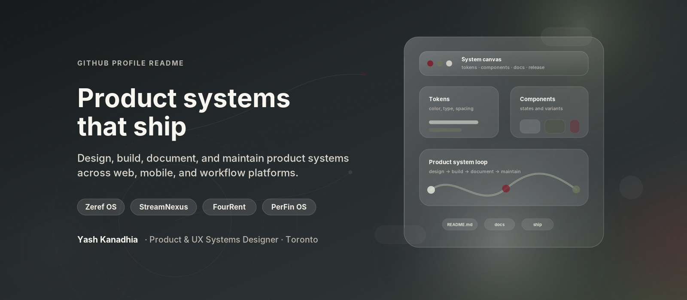

<p align="center">
  
</p>

<h1 align="center">Yash Kanadhia</h1>

<p align="center">
  <strong>AI Product & UX Systems Designer</strong><br />
  Toronto, Canada · Product strategy · UX systems · AI workflows · Web and mobile products
</p>

<p align="center">
  <a href="https://www.linkedin.com/in/yashkanadhia">LinkedIn</a>
  ·
  <a href="https://substack.com/@yashkanadhia">Substack</a>
  ·
  <a href="https://github.com/kanadhiayash">GitHub</a>
</p>

I design and build product systems across AI workflows, web platforms, and native mobile applications.

My work connects product strategy, UX architecture, interface systems, implementation, testing, documentation, and release discipline. I focus on turning ambiguous product problems into systems that another person can understand, run, inspect, and continue.

---

## Selected systems

| Project                                                                    | Product and technical signal                                                                                                                                                        | Stack                                                  | Evidence                                                                                                                               |
| -------------------------------------------------------------------------- | ----------------------------------------------------------------------------------------------------------------------------------------------------------------------------------- | ------------------------------------------------------ | -------------------------------------------------------------------------------------------------------------------------------------- |
| [Zeref Memory Engine](https://github.com/kanadhiayash/zeref-memory-engine) | Local-first memory for AI-assisted work, guarded writes, deterministic routing, cross-harness handoffs, local audit trails, and benchmark-gated releases                            | Python, CLI tooling, structured memory, GitHub Actions | [Benchmark report](https://github.com/kanadhiayash/zeref-memory-engine/blob/main/docs/BENCHMARK_REPORT.md)                             |
| [For Rent](https://github.com/kanadhiayash/forrent-swiftui-firebase-ios)   | Native iOS rental product with renter and landlord journeys, deterministic demo data, Firebase-backed clean mode, feature-oriented MVVM, accessibility, and automated quality gates | SwiftUI, Swift, Firebase, MVVM                         | [Testing and verification](https://github.com/kanadhiayash/forrent-swiftui-firebase-ios/blob/main/docs/05_TESTING_AND_VERIFICATION.md) |
| [StreamNexus](https://github.com/kanadhiayash/streamnexus)                 | Full-stack streaming-rental prototype with role-based workflows, MongoDB persistence, session authentication, security controls, server-rendered product flows, and CI              | Node.js, Express, MongoDB, EJS                         | [Architecture](https://github.com/kanadhiayash/streamnexus/blob/main/docs/architecture.md)                                             |

StreamNexus and For Rent are portfolio implementation projects. Their repositories state current deployment, release, and production limitations directly.

---

## Product and UX practice

I work across the path from problem framing to implementation:

* Product framing, constraints, and prioritization
* Information architecture and user flows
* Interaction design, interface states, and UX writing
* Design systems and design-development handoff
* Accessibility requirements and verification
* Technical architecture, implementation, testing, and documentation
* Release readiness, security review, and evidence-based public claims

My broader product portfolio also includes work in digital ownership, automotive marketplaces, and personal finance. Full case studies are being packaged separately from the code repositories.

---

## Engineering proof

I use AI as an implementation partner, not as a substitute for product or engineering judgment.

* Material changes move through scoped branches and pull requests.
* Behaviour changes require tests, automated checks, or documented manual verification.
* Architecture-impacting decisions are documented with constraints and tradeoffs.
* Security, dependency, release, and privacy checks remain visible in repository history.
* Public claims stay separate from assumptions, unknowns, planned work, and self-assigned targets.
* Credentials, private context, and environment-specific configuration stay outside public repositories.

Selected evidence:

* [Zeref architecture and shipped surfaces](https://github.com/kanadhiayash/zeref-memory-engine#what-zeref-ships)
* [Zeref benchmark methodology](https://github.com/kanadhiayash/zeref-memory-engine/blob/main/docs/BENCHMARK_REPORT.md)
* [For Rent architecture](https://github.com/kanadhiayash/forrent-swiftui-firebase-ios/blob/main/docs/architecture.md)
* [For Rent verification matrix](https://github.com/kanadhiayash/forrent-swiftui-firebase-ios/blob/main/docs/05_TESTING_AND_VERIFICATION.md)
* [StreamNexus architecture](https://github.com/kanadhiayash/streamnexus/blob/main/docs/architecture.md)
* [StreamNexus setup and quality gates](https://github.com/kanadhiayash/streamnexus#quality-gates)

---

## Product and technical scope

| Discipline             | Working scope                                                                                                         |
| ---------------------- | --------------------------------------------------------------------------------------------------------------------- |
| Product and UX         | Product framing, information architecture, user flows, interaction design, UX writing, accessibility, design systems  |
| AI systems             | Agent workflows, structured memory, deterministic routing, evaluation, prompt and context systems                     |
| Mobile                 | SwiftUI, React Native, Expo                                                                                           |
| Web                    | React, Node.js, Express, MongoDB, Firebase                                                                            |
| Engineering operations | GitHub Actions, branch and pull-request discipline, dependency review, release checks, documentation, security review |

---

## How I work

```text
Understand the product problem
→ inspect the current system and evidence
→ separate facts from assumptions
→ define the smallest complete change
→ implement through a reviewable branch
→ test and verify
→ document tradeoffs, limitations, and remaining risks
```

I prefer small, auditable changes over large opaque rewrites. A passing check is useful only when the check still protects the behaviour it was designed to verify.

---

## Current focus

* Hardening Zeref Memory Engine through deterministic benchmarks, release checks, and repository governance
* Packaging verified product, architecture, accessibility, and simulator evidence for For Rent
* Completing real screenshots, demo assets, and deployment evidence for StreamNexus
* Converting product-design work into complete case studies with clear decisions, constraints, and honest outcomes

---

## Selected credential

* **Scrum Fundamentals Certified**, SCRUMstudy, June 2026

Only completed credentials are listed.

---

## Connect

* [LinkedIn](https://www.linkedin.com/in/yashkanadhia)
* [Substack](https://substack.com/@yashkanadhia)
* [GitHub](https://github.com/kanadhiayash)

Open to Product Designer, AI Product Designer, Design Technologist, and UX/Product Systems opportunities in Canada.
